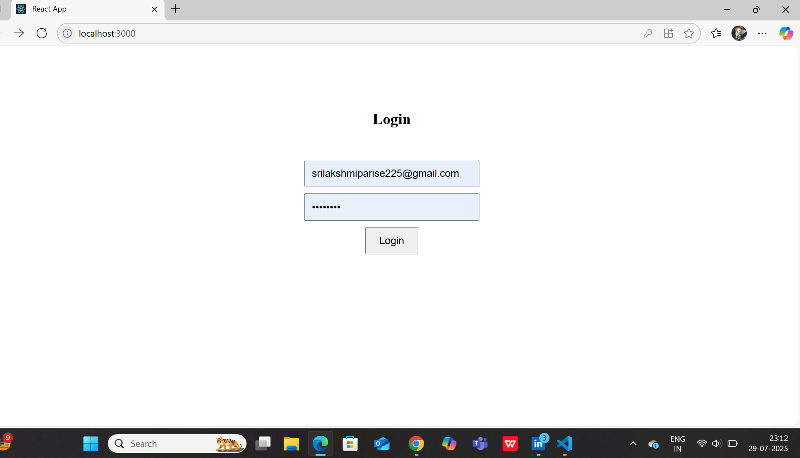
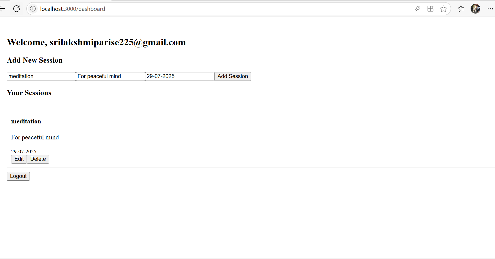

# Wellness Session Manager App

A full-stack web app to manage wellness sessions with secure authentication, session tracking, and CRUD features. Built as part of a company assignment using **React**, **Firebase Auth**, and **Firestore**.

---

## Features

 **User Authentication** (Firebase Auth)
  - Login & Logout
  - Private route protection

   **Session Management (CRUD)**
  - Add, view, update, and delete session notes
  - Each session includes a title, notes, and date
  - Sessions are linked to the logged-in user

   **Persistent Storage**
  - All data stored in Firebase Firestore
  - Real-time sync

-  **Clean UI & Functional Dashboard**
  - Simple layout with welcome message
  - Intuitive session form and session list
  - Logout button

---

# Tech Stack

- **Frontend**: React (Vite/CRA), React Router
- **Authentication**: Firebase Authentication
- **Database**: Firebase Firestore
- **State Management**: React Context API

##  Project Structure
client/
├── src/
│ ├── components/
│ │ ├── LoginPage.js
│ │ ├── Dashboard.js
│ │ ├── PrivateRoute.js
│ ├── context/
│ │ └── AuthContext.js
│ ├── App.js
│ ├── index.j
## How to Run Locally

1. **Clone the repo**
   ```bash
   git clone https://github.com/srilakshmi1725/welness-session-app.git
   cd welness-session-app
   Inside src/firebase.js, paste your Firebase credentials:
2. **Sorce Code**
import { initializeApp } from "firebase/app";
const firebaseConfig = {
  apiKey: "KEY",
  authDomain: "APP.firebaseapp.com",
  projectId: "PROJECT_ID",
  // ... rest
};
export const app = initializeApp(firebaseConfig);

## Run the app

npm start
##  Screenshots

###  Login Page


###  Dashboard View


###  Sessions Added



Contact
Srilakshmi Parise
srilakshmiparise225@gmail.com
https://www/linkedin.com/parisesrilakshmi1725
